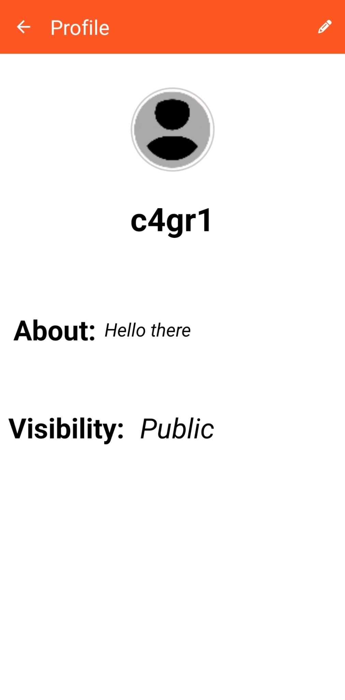
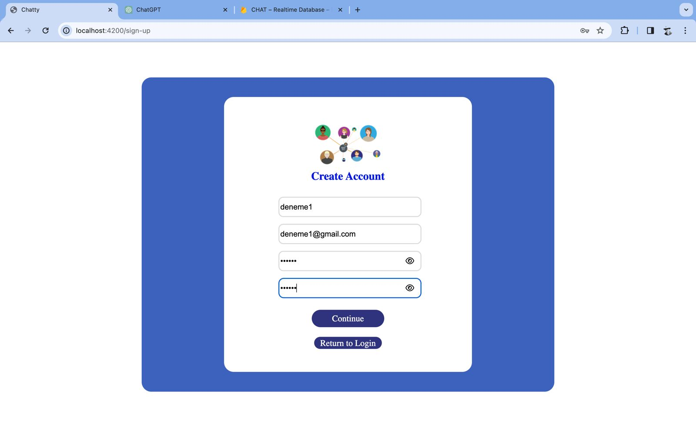

<h1 align="center"> Chatty Messaging Application </h1>   

 &nbsp;

# Chatty Messaging Application

Chatty is a dynamic and user-friendly messaging application developed using Angular and Kotlin, operating on both web and mobile platforms. Offering features such as real-time messaging, secure messaging and group chats, Chatty utilizes Firebase infrastructure for efficient data management.

## Features

- **User Account Creation and Management:** Secure login with email verification.
- **Private and Group Messaging:** Easy and fast communication.
- **Advanced User Settings:** Customizable theme options, notification settings, and user blocking.
- **Security and Privacy:** End-to-end encryption for protected conversations.

## Mobile Application Download

To download the **Android** application APK of Chatty, follow these steps:

1. Click the APK download link: [Download Chatty APK](https://github.com/ChatOrganizationSoftware/ChatApp/raw/main/chatty-apk/chatty.apk)
2. Open the downloaded APK file and follow the installation instructions.
3. Enable the "Install from Unknown Sources" option on your device, if required.
4. Once the installation is complete, open the Chatty application and start using it immediately!

## Web Application Access

To use the web version of Chatty, sign up for the app on the mobile app and then visit the link below:

[Chatty Web Application](https://chat-4ff93.web.app/)

## Technologies

- Angular
- TypeScript
- HMTL / CSS
- Kotlin
- Firebase
 
## Contributors

Çağrı Yıldız : [c4gr1](https://github.com/c4gr1)  
Furkan Taşkın : [CODER656](https://github.com/CODER656)  
Mustafa Balaban : [Mbalaban1776](https://github.com/Mbalaban1776)  
Tuğrul Yapıcı : [Tugrulfg](https://github.com/Tugrulfg)  

## Screenshots

* Chatty Mobile   

     &nbsp;
     &nbsp;
     &nbsp;
     &nbsp;
     &nbsp;
     &nbsp;

* Chatty Web   

     &nbsp;
     &nbsp;
     &nbsp;

  

